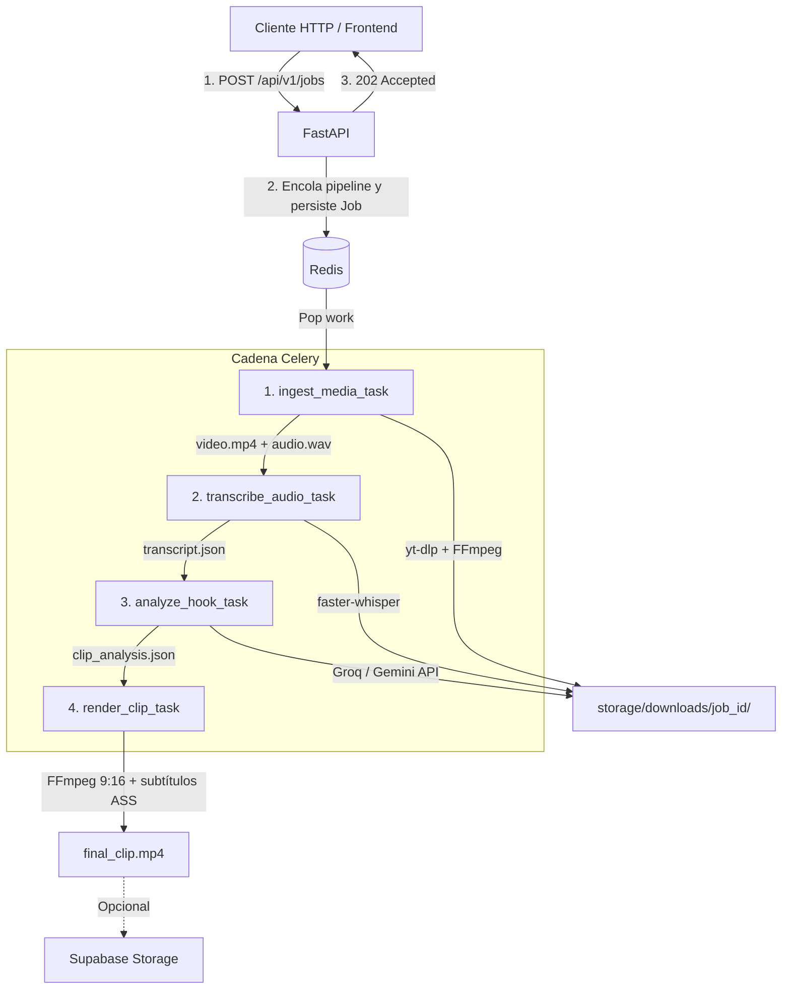

# AI Video Pipeline

Pipeline backend asíncrono que convierte videos largos de YouTube (16:9) en clips virales verticales (9:16) listos para TikTok, Instagram Reels y YouTube Shorts.

El sistema descarga el video, lo transcribe palabra por palabra con STT local, analiza la transcripción con un LLM para detectar el fragmento más viral (entre 30 y 75 segundos), y lo renderiza con subtítulos dinámicos estilo karaoke quemados directamente en el video.

---

## Arquitectura

El sistema usa un patrón **API REST + Workers Asíncronos**. La API responde con `202 Accepted` de forma inmediata y delega toda la carga pesada a una cadena de tareas Celery orquestadas con `chain`.



---

## Features

- **No bloqueante**: polling de estado en tiempo real vía Redis (`PENDING` → `COMPLETED`).
- **Transcripción local** con `faster-whisper` (CTranslate2, `int8` en CPU) — 4.300 palabras en ~1.8 min.
- **Detección de hooks con LLM**: Groq (Llama 3.3 70B) o Google Gemini, salida JSON validada con Pydantic.
- **Duración de clips**: entre **30 y 75 segundos**, compatible con monetización de TikTok Creator Rewards (>60s) y YouTube Shorts.
- **Renderizado vertical**: layout profesional con fondo desenfocado (blur) + video centrado nítido + subtítulos karaoke quemados.
- **$0 en infraestructura**: 100% local con Docker para Redis y fallback a filesystem si no hay Supabase.

---

## Stack

| Capa | Tecnología |
|---|---|
| Backend | Python 3.12+, FastAPI, Pydantic v2 |
| Async workers | Celery, Redis |
| Descarga de medios | `yt-dlp`, FFmpeg |
| Speech-to-Text | `faster-whisper` (CPU int8 / GPU) |
| LLM (detección de hook) | Groq API (`llama-3.3-70b-versatile`) o Google Gemini (`gemini-2.0-flash`) |
| Renderizado | FFmpeg — recorte, fondo blur, subtítulos `.ass` karaoke |
| Almacenamiento | Filesystem local + Supabase Storage (opcional) |

---

## Ciclo de Vida del Job

| Estado | Progreso | Descripción |
|:---|:---:|:---|
| `PENDING` | 0% | Job creado y encolado en Redis. |
| `DOWNLOADING` | 10% | Descarga del video y extracción de audio `.wav` con `yt-dlp`. |
| `DOWNLOADED` | 25% | Archivos multimedia listos en almacenamiento local. |
| `TRANSCRIBING` | 35% | Procesamiento del audio con `faster-whisper`. |
| `TRANSCRIBED` | 50% | `transcript.json` generado con timestamps por palabra. |
| `ANALYZING` | 65% | LLM analiza la transcripción para detectar el hook viral (30–75s). |
| `ANALYZED` | 75% | Fragmento detectado y validado. |
| `RENDERING` | 85% | FFmpeg recorta, reformatea a 9:16 y quema subtítulos `.ass`. |
| `COMPLETED` | 100% | `final_clip.mp4` listo. |
| `FAILED` | — | Excepción capturada con detalle de error persistido en Redis. |

---

## Estructura del Repositorio

```
IA_REEL/
├── app/
│   ├── api/                  # Endpoints REST (jobs, health) y dependencias
│   ├── core/                 # Configuración (pydantic-settings) y logging
│   ├── models/               # Schemas Pydantic (domain, analysis, transcription)
│   ├── services/
│   │   ├── ai/               # HookDetector — Groq y Gemini
│   │   ├── media/            # MediaDownloader — yt-dlp wrapper
│   │   ├── render/           # subtitle_generator.py y ffmpeg_renderer.py
│   │   ├── storage/          # SupabaseStorageService con fallback local
│   │   └── transcription/    # WhisperService — faster-whisper
│   └── workers/
│       ├── celery_app.py     # Configuración del broker Celery
│       ├── pipeline.py       # enqueue_pipeline() — chain de 4 tareas
│       └── tasks/            # ingest, transcribe, analyze, render
├── docker/                   # docker-compose.yml para Redis
├── storage/                  # Medios locales (gitignored)
├── tests/                    # 19 tests unitarios con Pytest
├── .env.example              # Plantilla de variables de entorno
└── requirements.txt
```

---

## Inicio Rápido

### Prerrequisitos

- Python 3.12+
- Docker & Docker Compose
- FFmpeg instalado en el sistema:
  - Fedora/RHEL: `sudo dnf install ffmpeg`
  - Ubuntu/Debian: `sudo apt install ffmpeg`

### 1. Instalación

```bash
cd IA_REEL

# Crear entorno virtual
python -m venv .venv
source .venv/bin/activate

# Instalar dependencias
pip install -r requirements.txt

# Configurar variables de entorno
cp .env.example .env
# Editar .env y completar LLM_PROVIDER + clave de API correspondiente
```

### 2. Levantar servicios

```bash
# Terminal 0: Redis (broker + job store)
docker compose -f docker/docker-compose.yml up -d redis

# Terminal 1: FastAPI
uvicorn app.main:app --reload --host 0.0.0.0 --port 8000

# Terminal 2: Celery worker (concurrency=1 requerido por faster-whisper)
celery -A app.workers.celery_app worker --loglevel=info --concurrency=1
```

---

## API REST

### Crear un Job

```bash
curl -X POST http://localhost:8000/api/v1/jobs \
  -H "Content-Type: application/json" \
  -d '{"url": "https://www.youtube.com/watch?v=VIDEO_ID"}'
```

Respuesta `202 Accepted`:

```json
{
  "id": "e4a2f8b0-1234-4567-89ab-cdef01234567",
  "source_url": "https://www.youtube.com/watch?v=VIDEO_ID",
  "status": "pending",
  "progress": 0,
  "message": "Job queued for ingestion",
  "created_at": "2026-08-14T00:00:00Z",
  "updated_at": "2026-08-14T00:00:00Z"
}
```

### Consultar estado

```bash
curl http://localhost:8000/api/v1/jobs/e4a2f8b0-1234-4567-89ab-cdef01234567
```

Cuando termina, la respuesta incluye `final_clip_path` y `clip_url` con la ubicación del clip generado.

Documentación interactiva: `http://localhost:8000/docs`

---

## Tests

```bash
pytest tests/ -v
# 19 tests — ffmpeg_renderer (5), hook_detector (5), pipeline (1),
#            storage (2), subtitle_generator (2), whisper_service (3), health (1)
```

---

## Autor

**Augusto Enrique Pugliano**  
Estudiante Avanzado de Ingeniería Informática | Backend & AI Developer
