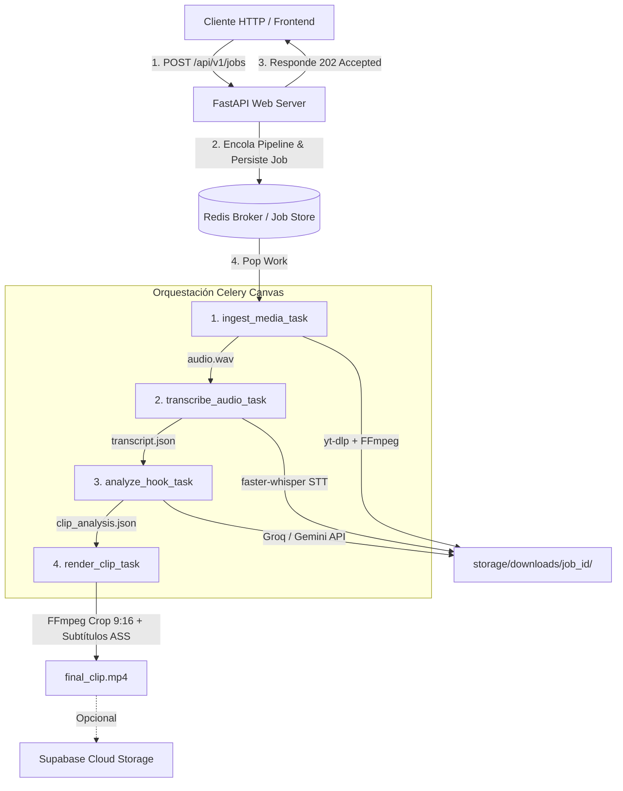

# AI Video Clipper Pipeline

Plataforma backend asíncrona para la ingesta automatizada de videos largos de YouTube (16:9), transcripción precisa palabra por palabra con Speech-to-Text local, análisis semántico con LLMs para detección de fragmentos virales (hooks de 30-60s) y reencuadre vertical (9:16) con subtítulos dinámicos mediante FFmpeg.

---

## Arquitectura del Sistema

El sistema utiliza un patrón de **API REST Síncrona + Workers Asíncronos Desacoplados**. La API responde de inmediato con código `202 Accepted` y delega la ejecución pesada a una cadena de tareas orquestadas mediante Celery Canvas (`chain`).



---

## Características Principales

* **Procesamiento Asíncrono No Bloqueante:** Control de estados en tiempo real mediante polling vía Redis (`PENDING` a `COMPLETED`).
* **Transcripción Local Optimizada:** Integración con `faster-whisper` (CTranslate2) con cuantización `int8` en CPU para timestamps palabra por palabra (*word-level timestamps*).
* **Detección Inteligente de Hooks:** Inferencia mediante LLMs (Groq Llama 3.3 / Gemini Flash) forzando salidas JSON estructuradas con Pydantic.
* **Renderizado Multimedia Directo:** Motor FFmpeg para recorte dinámico 16:9 a 9:16 y quemado de subtítulos dinámicos (`.ass`).
* **Diseño para Entorno Local ($0 USD):** Arquitectura pensada para ejecutar 100% sobre contenedores Docker sin costos de infraestructura.

---

## Stack Tecnológico

* **Backend Framework:** Python 3.12, FastAPI, Pydantic v2
* **Orquestación Asíncrona:** Celery, Redis
* **Ingesta de Medios:** `yt-dlp`, FFmpeg
* **Speech-to-Text:** `faster-whisper` (CPU int8 / GPU)
* **Modelos IA (LLM):** Groq API (`llama-3.3-70b-versatile`), Google AI Studio (`gemini-1.5-flash`)
* **Almacenamiento:** Sistema de archivos local + Supabase Storage API

---

## Ciclo de Vida del Job (`JobStatus`)

| Estado | Progreso (%) | Descripción |
| :--- | :---: | :--- |
| `PENDING` | 0% | Tarea creada y encolada en Redis. |
| `DOWNLOADING` | 10% | Descarga del video y extracción de audio `.wav` mediante `yt-dlp`. |
| `DOWNLOADED` | 25% | Archivos multimedia listos en almacenamiento local. |
| `TRANSCRIBING` | 35% | Procesamiento del audio con `faster-whisper`. |
| `TRANSCRIBED` | 50% | Generación de `transcript.json` con timestamps palabra por palabra. |
| `ANALYZING` | 65% | Consulta al LLM para identificar el hook viral (30-60s). |
| `ANALYZED` | 75% | Fragmento del hook identificado y validado. |
| `RENDERING` | 85% | Aplicación de crop 9:16 y quemado de subtítulos `.ass` con FFmpeg. |
| `COMPLETED` | 100% | Clip final generado listo para entrega (`final_clip.mp4`). |
| `FAILED` | 0% | Manejo de excepción con detalle de error persistido en Redis. |

---

## Estructura del Repositorio

```text
IA_REEL/
├── app/
│   ├── api/                  # Endpoints REST y dependencias
│   │   └── routes/           # Healthcheck y administración de Jobs
│   ├── core/                 # Configuración central (pydantic-settings) y logging
│   ├── models/               # Esquemas Pydantic (domain, analysis, transcription)
│   ├── services/             # Lógica de negocio pura
│   │   ├── ai/               # Detector de Hooks con Groq/Gemini
│   │   ├── media/            # Downloader wrapper de yt-dlp
│   │   ├── render/           # Generador de subtítulos ASS y motor FFmpeg
│   │   └── transcription/    # Servicio STT faster-whisper
│   └── workers/              # Configuración de Celery, tareas atómicas y pipeline
│       └── tasks/            # Ingest, Transcribe, Analyze, Render
├── docker/                   # Dockerfile de worker y docker-compose.yml
├── storage/                  # Almacenamiento local de medios (gitignored)
├── tests/                    # Suite de pruebas unitarias con Pytest
├── .env.example              # Plantilla de variables de entorno
├── requirements.txt          # Dependencias del proyecto
└── README.md
```

---

## Guía de Inicio Rápido

### Prerrequisitos

* Python 3.12+
* Docker & Docker Compose
* FFmpeg instalado en el sistema (`sudo dnf install ffmpeg` o `sudo apt install ffmpeg`)

### 1. Instalación Local

```bash
# Entrar al proyecto
cd IA_REEL

# Crear y activar entorno virtual
python -m venv .venv
source .venv/bin/activate

# Instalar dependencias
pip install -r requirements.txt

# Configurar variables de entorno
cp .env.example .env
```

### 2. Ejecución de Servicios

```bash
# Iniciar servidor Redis en Docker
docker compose -f docker/docker-compose.yml up -d redis

# Terminal 1: Iniciar API de FastAPI
uvicorn app.main:app --reload --host 0.0.0.0 --port 8000

# Terminal 2: Iniciar Celery Worker
celery -A app.workers.celery_app worker --loglevel=info --concurrency=1
```

---

## Uso de la API REST

### Crear un nuevo Job

```bash
curl -X POST http://localhost:8000/api/v1/jobs \
  -H "Content-Type: application/json" \
  -d '{"url": "[https://www.youtube.com/watch?v=dQw4w9WgXcQ](https://www.youtube.com/watch?v=dQw4w9WgXcQ)"}'
```

Respuesta HTTP (`202 Accepted`):

```json
{
  "id": "e4a2f8b0-1234-4567-89ab-cdef01234567",
  "source_url": "[https://www.youtube.com/watch?v=dQw4w9WgXcQ](https://www.youtube.com/watch?v=dQw4w9WgXcQ)",
  "status": "pending",
  "progress": 0,
  "message": "Job queued for processing",
  "created_at": "2026-08-13T04:00:00Z"
}
```

### Consultar Estado

```bash
curl http://localhost:8000/api/v1/jobs/e4a2f8b0-1234-4567-89ab-cdef01234567
```

Documentación interactiva disponible en: `http://localhost:8000/docs`

---

## Pruebas Unitarias

```bash
pytest tests/ -v
```

---

## Autor

Desarrollado por **Augusto Enrique Pugliano**  
Estudiante Avanzado de Ingeniería Informática | Backend & AI Software Developer
